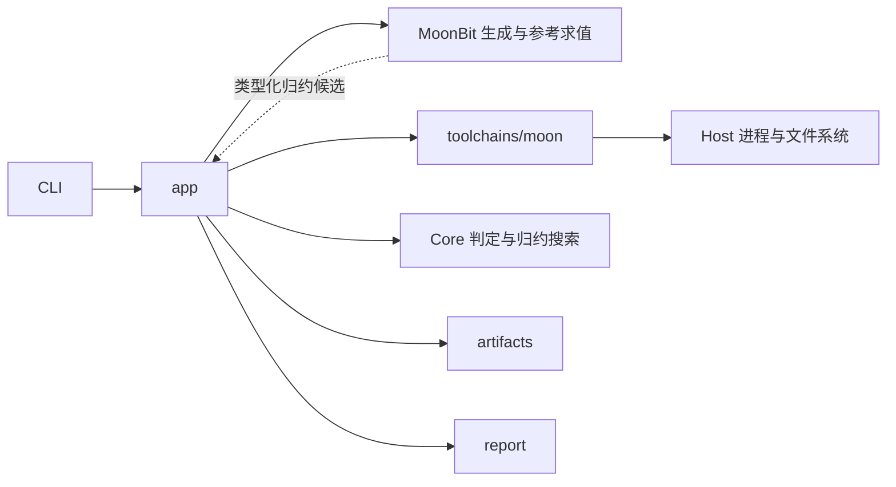

# 贡献指南

## 开发准备

先保证本机 `moon` 已在 `PATH` 中，官方安装目录为 `~/.moon/bin`。然后在仓库根目录运行
`just deps` 初始化 MoonBit 包索引，再运行 `just install`，把 `prek` 的 `pre-commit` 和
`commit-msg` hooks 装进本仓库 `.git/hooks/`。依赖包会在首次检查或构建时下载。
检查工具配置见 [prek.toml](prek.toml) 和 [CI 工作流](.github/workflows/ci-static-checks.yml)。

## 常用命令

| 命令 | 作用 |
| --- | --- |
| `just` | 列出开发命令 |
| `just deps` | 初始化或刷新 MoonBit 包索引 |
| `just install` | 安装 Git hooks |
| `just format` | 格式化 justfile 和 MoonBit 包 |
| `just check` | 仓库只读门禁，运行 `prek --all-files` |
| `just build` | 构建 workspace 全部模块及 native 可执行入口 |
| `just test` | 运行单元测试及真实 MoonBit 工具链集成测试 |
| `just run` | 生成一个案例，执行三种编译配置并保存结果 |

新增文件需纳入 Git 索引后才能被 `--all-files` 检查。尚不准备暂存内容时可使用
`git add --intent-to-add <文件>`；单独检查未跟踪文件也可运行
`uvx --from prek==0.3.10 prek run --files <文件>`。

文档变更运行 `just check` 和 `git diff --check`。实现变更运行 `just check`、`just build` 与
`just test`，并增加或运行相关行为测试。入口变更还需运行 `just run`。进程生命周期、判定和
归约必须覆盖其实际失败边界，不能只断言内部调用。
未来的编译器测试矩阵与 MoonSmith 自身的构建检查分别记录；当前 CI 的 native 检查不代表
四后端、五配置验证已经完成。

## 质量检查

第三方 hooks 的版本固定在 `prek.toml`，本地 `just check` 与 CI 使用同一入口。

| 工具 | 检查范围 |
| --- | --- |
| MoonBit、Just | 源码格式、类型、编译器警告及任务文件格式 |
| alint | 包结构、依赖方向与纯计算边界 |
| Tombi、yamllint | TOML 格式与 lint，YAML 缩进、重复键及布尔值 |
| rumdl、typos、lychee | Markdown 结构、拼写及本地链接 |
| check-jsonschema | Renovate 配置与 `schemas/` 下的 JSON Schema 定义 |
| actionlint、zizmor | GitHub Actions 语法、表达式及工作流安全问题 |
| Gitleaks | 工作区中的凭据和令牌，包括未跟踪文件；日志隐藏匹配值 |
| prek 文件检查 | 大文件、跨平台文件名、符号链接、脚本权限、意外子模块及文本卫生 |
| ZenDev | 提案结构与索引，提交及 PR 消息规范 |

新增的格式检查不自动改写文件。Markdown 使用 [.rumdl.toml](.rumdl.toml)，允许中文长段落、
GitHub 裸链接及 FP 的元数据标题；YAML 规则见 [.yamllint.yml](.yamllint.yml)。Tombi 和
zizmor 使用离线模式，JSON Schema 检查使用工具内置的 schema。Gitleaks 检查当前工作区，
通过 [.gitleaks.toml](.gitleaks.toml) 排除构建缓存、依赖下载、托管 worktree 和实验产物。

## 模块与包边界

根目录的 [moon.work](moon.work) 组织四个独立 module；每个 module 有自己的 `moon.mod`、
版本、依赖、README 和 LICENSE。module 是发布单位，内部 package 由 `moon.pkg` 定义，是编译与
命名空间单位。采用 [Moon workspace](https://docs.moonbitlang.com/en/stable/toolchain/moon/workspace.html)
的本地成员解析，不使用旧格式的路径依赖。

| 目录 | Module 名称 | 仓库内模块依赖 |
| --- | --- | --- |
| `modules/contracts` | `zrr1999/moonsmith-contracts` | 无 |
| `modules/core` | `zrr1999/moonsmith-core` | contracts |
| `modules/moonbit` | `zrr1999/moonsmith-moonbit` | contracts |
| `modules/cli` | `zrr1999/moonsmith` | contracts、core、moonbit |

四个模块的 `0.0.0` 都是初始占位版本，尚未发布；后续分别管理版本，无需同步升级。
`moon.mod` 使用带版本的依赖声明，workspace 内按成员名解析到本地源码。成员版本变化后
运行 `moon work sync` 更新依赖方声明。`moon.pkg` 的 import 声明实际调用的包，模块版本依赖与包导入分别维护。

下表列出全部九个 package。contracts、core 和 moonbit 各自的 `src/moon.pkg` 定义根包，
包名等于模块名。其余六个包位于 CLI 模块内，完整包名为
`zrr1999/moonsmith/<相对 src 的路径>`。

| 包 | 所属模块 | 职责 | 允许的仓库内依赖 |
| --- | --- | --- | --- |
| `contracts` | `zrr1999/moonsmith-contracts` | 语言无关的配置、观察值、预算和案例记录 | 无 |
| `core` | `zrr1999/moonsmith-core` | 纯测试编排、判定和归约搜索 | `contracts` |
| `moonbit` | `zrr1999/moonsmith-moonbit` | MoonBit 程序表示、生成、解释、源码输出和归约候选 | `contracts` |
| `host` | `zrr1999/moonsmith` | 进程生命周期、文件系统及平台访问 | `contracts` |
| `toolchains/moon` | `zrr1999/moonsmith` | Moon 工具链探测、命令计划及诊断分类 | `contracts`、`host` |
| `artifacts` | `zrr1999/moonsmith` | 案例持久化和追加式执行记录 | `contracts`、`host` |
| `report` | `zrr1999/moonsmith` | 从传入的记录生成报告 | `contracts` |
| `app` | `zrr1999/moonsmith` | 装配具体适配器，协调执行、存储及报告 | 上述各包 |
| `cmd/moonsmith` | `zrr1999/moonsmith` | CLI 参数、终端交互和退出码 | `app`、`host` |

Core 和语言包保持纯计算，通过参数与返回值交互。Core 不导入 MoonBit AST、Host 或存储包；
报告包不自行读写文件。`app`、CLI、Host、工具链及存储包目前限定为 native，纯计算包保留
其他后端的使用空间。后续 Rust、Swift 适配器与 `moonbit` 并列，由 `app` 选择和装配。

Core 提供独立于语言的结果判定和泛型归约状态机，MoonBit 模块提供类型化程序、生成、
求值、源码输出及归约候选。各包的行为测试放在相应包内，优先通过公共接口测试。
模块拆分的理由和兼容性见 [FP-0001](fps/FP-0001-workspace-modules.md)。

[.alint.yml](.alint.yml) 检查 workspace 布局、模块与包清单、当前组件之间的依赖方向，并阻止
纯计算组件直接导入已列出的环境与 I/O 依赖。import 检查覆盖 `moon.mod` 与 `moon.pkg`，
依赖 `moon fmt` 规范化的格式；新增模块、包或依赖时同步核对规则。
`just check` 和 CI 都通过 prek 执行 alint，单独运行可用
`uvx prek run alint --all-files`。

## 原型执行契约

原型使用 `int-bool-v1`：整数常量、加减、布尔条件、分支和三个顺序局部绑定。显式种子驱动
标准库 ChaCha8，生成深度限定为 `0..4`；程序不含循环、递归或 I/O，除输出一个整数外无副作用。
生成树区分整数与布尔表达式，变量只能引用已有绑定；参考求值器用 Int64 计算中间值，拒绝
越界的 Int 运算及非法引用，包括未执行分支。生成种子、深度及 profile 相同则源码相同。



Core 接收配置标识、参考输出及执行观察值，不导入 MoonBit AST 或宿主 I/O。
`reference_assessment` 同时保留各配置的判断；库调用方用明确的 Oracle、配置、阶段与异常类别
选择失败判据。每个配置分别记录编译和执行阶段，编译未成功时执行检查不适用。
`ReductionSession[P]` 集中管理候选合法性、接受规则、失败保持、预算及内存记录，
分别保存原程序、当前搜索位置和最佳结果。具体搜索方法通过提交候选与读取反馈驱动会话。

原型的 `Reducer[P]` 复用该会话，接收语言提供的候选、合法性和规模函数，选择严格下降的程序。
构造时需要初始证据和失败判据；`app` 执行请求中的候选，用请求标识和候选自己的 `Assessment`
交回结果，Core 仅接受保持所选判据的合法候选。非法与不满足接受规则的候选同样计入预算；
过期响应不能更新会话。测试另用整数模型驱动枚举、线性与二分搜索，检验策略替换和共享约束；
Rust、Swift 的语义适配尚待各自实现。库调用约定见[Core README](modules/core/README.md)。

工具链按 native debug、native release、wasm-gc debug 顺序执行。每个案例尝试使用全新目录，
先运行 `moon build`，再直接运行 native 产物或交给 `moonrun`，分别记录编译与执行状态。
编译超时为 30 秒，程序执行超时为 2 秒，每个输出流上限为 64 KiB。
Host 通过固定版本 `moonbitlang/async@0.22.4` 收集输出及回收直接子进程；进程树隔离与后代
清理尚未实现，因此这个原型只执行自身生成的受限程序，不作为任意不可信程序的沙箱。

所有配置都成功且输出文本精确对应参考文本时，判定为 `Match`。非零退出和结果不一致记录为
异常候选；其他配置中的超时或缺失观察不能掩盖已观测到的明确异常。没有明确异常时，
超时、输出超限、宿主错误及缺失观察值记录为 `Inconclusive`。fingerprint 由配置、
阶段及异常类别（含退出码）组成，用于维持当前归约判据，尚不保证不同案例属于同一个编译器缺陷。
归约默认最多检查 16 个候选，可用 `--budget 0..64` 调整；最终结果在新目录复测，不声称全局最小。
复测按所选失败判据确认，即使出现其他异常导致报告主结论变化，也不替换原归约目标。

`demo` 在 native release 执行成功后设置单独的 `injected_stdout`，原始 stdout/stderr 保留。
报告明确标注故障注入。真实执行中发现异常仍需人工确认，多个配置一致也不等于编译器完全正确。

`runs/` 下每个案例包含 `case.json` 与 `original.mbt`。每次执行、归约候选、最终确认和重放都
追加独立的 `attempts/run-*/`，保存可直接构建的项目、`report.md` 和 `attempt.json`。
所有记录使用独占创建；`attempt.json` 最后写入，缺少它的目录表示未完成尝试。
现有 `Case` / `Attempt` JSON 格式保持不变，`Attempt.verdict` 仍是报告用的主结论；
完整判断可从所存的参考值与观察重建。新归约会话的事件记录尚未持久化，也不提供搜索恢复。
stdout/stderr 以 UTF-8 文本记录，无效编码使用替换字符。重放校验 profile、种子对应的源码和
参考结果，在当前工具链上重新运行原案例，并保留原有文件。故障注入案例重放时继续使用其
明确记录的注入模式。

CLI 退出码：`0` 为一致，`2` 为异常候选（包括演示注入），`3` 为无法判定，`1` 为参数或操作错误。
`just run --help` 查看入口；`just run demo` 和对应的重放预期返回 `2`。
测试分别覆盖确定性、手算参考值、非法作用域及溢出、失败判据保持、预算、子进程退出、
输出上限、原始案例保留和真实工具链执行。当前原型覆盖两个后端、三种配置，完整比赛矩阵
及更丰富的语言构造按申报书继续扩展。

## 提交与 PR

提交及 PR 标题使用英文，保留 ZenDev 的 emoji 和类型配对，例如：

```text
🎉 init: bootstrap MoonSmith repository
📝 docs(architecture): define the compiler validation pipeline
✨ feat(generator): generate bounded boolean expressions
🐛 fix(reducer): preserve the failure predicate
```

本地检查示例：

```shell
uvx --from zendev==0.4.0 zendev message check --title --profile zendev --text "📝 docs: clarify the execution matrix"
```

PR 正文使用[模板](.github/pull_request_template.md)，说明动机、解决方案和实际验证。
正文面向不了解会话背景的评审者，聚焦本 PR 相对 base 的改动：解决的问题、最终设计或
行为、影响及直接相关的验证。依赖、兼容性和迁移信息仅在影响评审或使用时补充；省略
操作流水、协作过程、其他 PR 的工作总结和与本次改动无关的能力说明。
不要在 PR 正文罗列本地测试情况、测试命令、机器路径、通过清单或 CI 状态。
“验证”章节可省略，仅在影响评审时说明验收方法或关键证据限制；实际检查仍按本文执行，
执行记录保留在 CI 或任务交付记录中。
所有 PR 都检查标题；依赖更新机器人仅豁免正文模板。机器校验格式，英文表述由提交者及
评审者核对。提交、推送和 PR 的交付范围以当前任务的明确授权为准。

## 设计与证据

只有已有设计未覆盖、且有明确大影响面的新决定才使用 [FP](fps/README.md)，门槛见
[FP-0000](fps/FP-0000-governance.md#何时需要-fp)。文档纠错、恢复预期行为的意外 bug 修复、
普通兼容增强和既定设计的实现无需新提案；原 bug 严重或改动量大本身不是提案理由。
提案记录取舍，架构维护整体设计，实现 PR 关联对应文档并附实际验证。

提案变更运行 `uvx --from zendev==0.4.0 zendev proposal check --fix` 更新
`fps-index.json`，再运行 `just check`。索引不手工维护；`just check` 和 CI 都检查 FP。

架构和实现按同一个小切片更新。产品方向改变时，在 [EVOLUTION.md](EVOLUTION.md)
记录日期、触发、变化和理由。比赛范围与验收目标维护在[申报书](docs/project-proposal.md)中，
实测结果另附工具链、环境与原始记录。

固定回归案例纳入版本控制；批次实验产物放在忽略的 `runs/`。引用公开缺陷、历史项目或
第三方代码时保留来源及许可证说明。记录 AI 辅助的范围，人工核验涉及语义和实验的结论。
