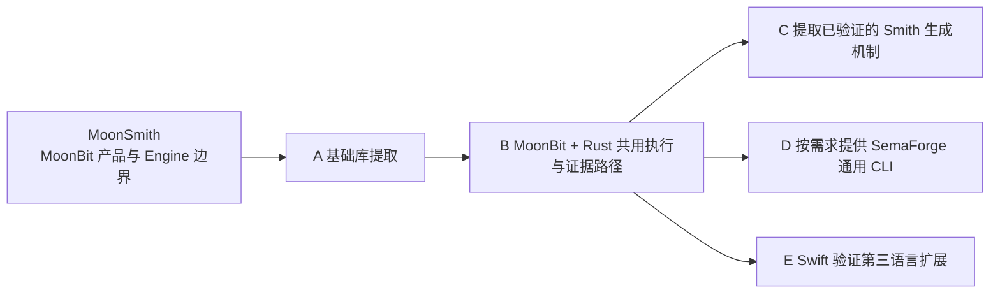
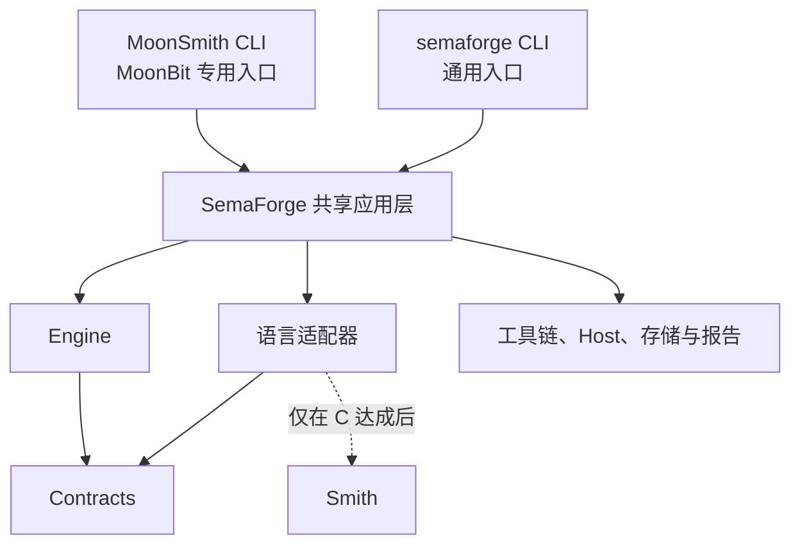

# 长期路线图

更新日期：2026 年 10 月 10 日。

MoonSmith 面向 MoonBit 提供独立的语义测试产品；SemaForge 是计划从其中逐步提炼的多语言
编译器语义验证平台。先验证并提取公共库，再按真实需求提供通用产品入口，MoonSmith
持续承担 MoonBit 专用体验。

本文维护未来目标、依赖和推进条件；[EVOLUTION.md](EVOLUTION.md)记录已经发生的方向
变化与原因；[FP](fps/README.md) 的 `status` 表达每份提案当前所处阶段。
文档职责见 [FP-0000](fps/FP-0000-governance.md#文档分工)。

截至更新日，四模块原型已提供受限 MoonBit 生成、参考求值、三配置比较、归约、存储与
重放，通用计算模块已更名为 Engine。完整语义子集、实验矩阵、跨案例编排、确认策略和
进程树清理等仍待扩展；可替换归约会话也尚未实现。当前边界见
[原型执行契约](CONTRIBUTING.md#原型执行契约)与[Engine 实现](modules/engine/README.md)。
SemaForge、Rust、Smith 和 Swift 均为后续目标，下面的模块名不代表已实现或已发布。

## 阶段与推进门槛



| 门槛 | 所需证据 | 达成后的变化 |
| --- | --- | --- |
| A：基础库提取 | 启动第二语言工作；拟提取模块通过依赖隔离、契约适用性和行为回归审查 | Contracts、Engine 按各自成熟度迁入 SemaForge namespace |
| B：第二语言闭环 | MoonBit 与明确的 Rust 子集复用判定、预算、归约和证据路径，案例可重放 | 形成双语言平台基础，完成 MoonBit 适配器迁移并接入 Rust 适配器 |
| C：Smith 提取 | 两个生成器中出现稳定、可独立验证且有复用收益的公共机制 | 创建 `semaforge-smith`，两个适配器使用已提取能力 |
| D：通用产品 | B 达成、Rust benchmark 可复现，并出现通用 CLI 的实际使用需求 | 提供 `semaforge`，MoonSmith 保留为 MoonBit 专用入口 |
| E：Swift 验证 | 双语言基础稳定；Swift 接入后已有语言回归通过，扩展成本与接口变化可解释 | 取得第三语言对平台架构的验证证据 |

A 不要求 Contracts 和 Engine 同时迁移。C、D、E 分别验收：没有可提取的生成机制时
不创建 Smith，通用 CLI 不等待 Smith 或 Swift，也不因支持第三语言就自动启动产品发布。
月份仅用于安排首版工作，不触发模块更名、namespace 迁移或发布。

## 阶段 1：完成 MoonSmith 产品与 Engine 边界

当前保留四个模块：

| 模块 | 职责与依据 |
| --- | --- |
| `moonsmith-contracts` | [共享契约](fps/FP-0001-workspace-modules.md#term-shared-contracts)：实际跨组件使用的数据 |
| `moonsmith-engine` | [Engine](fps/FP-0001-workspace-modules.md#term-engine)：纯测试编排、证据判定和归约搜索 |
| `moonsmith-moonbit` | [语言适配器](fps/FP-0001-workspace-modules.md#term-language-adapter)：MoonBit 语义、生成、求值、输出和归约候选 |
| `moonsmith` | [应用装配](fps/FP-0001-workspace-modules.md#term-application-layer)、[Host](fps/FP-0001-workspace-modules.md#term-host)、工具链、存储、报告及 CLI |

Core → Engine 仅明确现有职责名称，模块路径和导入同步迁移，不提供旧模块转发层；
公开函数和类型行为、CLI、生成规则及案例格式保持不变。此阶段不创建 `semaforge-*` 占位模块。

在现有 `int-bool-v1` 基础上扩大明确的 MoonBit 语义子集，每次围绕可运行案例贯穿四个模块。
语言层继续拥有程序表示、类型与语义、合法性及具体生成规则；Engine 不解释 AST 或访问宿主 I/O。
目标子集见[功能范围](docs/project-proposal.md#核心功能范围)，现有能力见 [MoonBit 模块](modules/moonbit/README.md)。

每次扩展都应保持产品闭环：显式种子与预算 → 程序、参考结果和源码 → 可用配置上的执行
与比较 → 证据保存 → 保持原失败判据的归约与重放。不等待某个模块完整实现才开始集成。
Engine 的合成程序测试与真实工具链产品验收分别提供证据，检查通过不意味着全部设计已经实现。

沿用首版规划的四个里程碑，日期用于安排工作，达标依据是实际结果：

| 里程碑 | 目标窗口 | 交付与通过条件 |
| --- | --- | --- |
| M0 最小闭环 | 10 月 9—12 日 | 固定工具链；打通微型语义模型、两个配置与规范观察；完成进程生命周期检查；尝试真实历史案例复现 |
| M1 生成与验证 | 10 月 13—19 日 | 扩展到约定语义子集，完成参考解释、有限变换和五项执行矩阵；固定输入可重现生成结果 |
| M2 归约与证据 | 10 月 20—25 日 | 类型感知候选、失败判据、归档重放与历史清单；验证归约不把原差异替换成另一类失败 |
| M3 交付与展示 | 10 月 26—30 日 | 完成约定样本实验、回归、安装说明、来源记录和演示；按实测结果说明首版覆盖及缺口 |

Host 生命周期和可获取历史案例应尽早验证。旧工具链不可获得时，保留失败尝试并选择
其他有完整环境的案例。量化验收目标由[项目验收计划](docs/project-proposal.md#预期验收产物)
统一维护；可控故障、历史复现与随机发现分别报告。

### MoonBit 语义模型的推进顺序

[程序模型与语义契约设计稿](.agents/notes/design/moonbit-semantics.md)先独立明确语言层保证，
提案编号及原 FP-0002 的处理留待后续。本节安排依赖，不改变上面的目标窗口，也不表示设计已采纳或实现。

| 顺序 | 主要责任方 | 推进条件与产物 |
| --- | --- | --- |
| 1. 澄清原型语义 | MoonBit | 区分合法性、profile 准入和求值；用手工及负面案例建立原型行为基线，保持既有 profile 含义 |
| 2. 验证参考与源码 | MoonBit、应用层与工具链 | 固定观察协议，取得声明配置下的真实执行证据，确认参考值与源码对应同一程序 |
| 3. 验证生成与特征 | MoonBit | 显式种子与预算；检查结构和源码重现，特征能从手工及生成程序独立提取 |
| 4. 验证变换与归约 | MoonBit、Engine、应用层与存储 | 区分语义关系与失败保持，候选使用自身证据，原案例保留且可重放 |
| 5. 扩展首版构造 | MoonBit 为主，按实际数据需求协调其他模块 | 逐项确定局部绑定、非递归函数、元组和枚举的子集；每项通过完整能力与产品闭环后再纳入支持范围 |

这些步骤复用现有闭环，用来组织新增验证，不要求重写已有效的能力或等整个语言模块完成才集成。
每次实现同步更新所属模块说明、原型执行契约和相关行为测试；跨边界数据从真实调用中提取，
不先建立通用语言接口。验收场景见设计稿，量化实验目标继续由项目申报书维护。

## 阶段 2：逐步提取 SemaForge 库

### A：先审查 Contracts 与 Engine

第二语言工作启动后，按实际调用路径检查拟提取模块。Engine 不依赖具体语言、Smith 或
宿主 I/O；Contracts 不依赖其他内部模块。依赖隔离只是必要条件，还需验证失败判据、
候选预算、合法性反馈与原始证据保留等行为不因提取而变化。

当前 `Case`、`Attempt` 中的 `depth`、单份源码、参考文本和规模字段承载原型假设。
逐项区分通用数据与产品/profile 数据，明确适用范围；不能仅因没有导入 MoonBit 就宣布
现有记录格式适用于所有语言。跨语言的格式演进由真实需求驱动，并验证旧案例重放。

每个达到条件的模块分别迁移，允许过渡期同时存在：

```text
semaforge-contracts
semaforge-engine
moonsmith-moonbit
moonsmith
```

迁移保留依赖方向和可运行的 MoonBit 产品。namespace 变化本身不要求迁仓库、统一版本
或立即发布；没有通过审查的模块继续留在原位置。

### B：用 Rust 验证公共边界

Rust 保留自己的程序表示、类型环境和语义状态。先选择受限且可验证的子集，明确所有权、
移动、借用、生命周期及未定义行为约束，逐项建立生成、观察和归约规则。

两门语言须实际共用 Engine 的判定、预算和归约基础，应用层关联执行与证据；同时保留
语言和 profile 的识别及来源。记录新增语言所需的修改、共享代码与接口变化，用两条可运行
路径证明复用。完成后形成 `semaforge-contracts`、`semaforge-engine`、`semaforge-moonbit`
与 `semaforge-rust`；此时不要求存在 Smith。

MoonSmith CLI 始终面向 MoonBit。Rust 在通用产品出现前使用库和实验入口；实验可以
复用现有宿主包，平台库不反向依赖 MoonSmith 的应用装配或 CLI。

benchmark 固定工具版本、语义子集、种子、预算和环境，记录有效性、特征覆盖、复现质量、
归约效果与执行成本。沿用[对比项目与基准规划](.agents/notes/research/comparison-projects.md)，将 RustSmith
与 Rustlantis 作为候选参照，按源码和 MIR 等不同输入层次分别解释结果。

### C：从两个生成器中提取 Smith

Smith 是 SemaForge 中拟议的程序生成子系统。仅当 MoonBit 和 Rust 的生成器出现稳定
公共机制，并能证明共享后的行为与收益时，才创建 `semaforge-smith`。
不预设所有语言都必须实现的生成接口，也不为目录完整提前创建空包。

语言适配器调用 Smith，Smith 不反向依赖具体适配器。AST、类型规则、语义状态和具体
生成规则仍由语言拥有；Smith 不接管 Engine 的归约搜索，两者不形成相互依赖。
若始终没有值得共享的生成机制，继续保留各语言生成器，不把 Smith 作为其他门槛的前置条件。

## 阶段 3：按需求形成通用产品，验证第三语言

### D：共享应用层与两个产品入口

双语言闭环、Rust benchmark 和真实 CLI 需求共同触发通用产品。将共享应用逻辑迁入
SemaForge 产品模块，统一装配 Engine、语言适配器、工具链、Host、存储和报告。
MoonSmith 与通用 CLI 都调用该应用层，不通过互相调用 CLI 或复制流程实现复用。



目标是 `moonsmith run` 与 `semaforge run --language moonbit` 在相同 profile、参数和
环境下共享执行语义。MoonSmith 保留 MoonBit 专用默认值与体验；确定性的范围按生成器
版本和环境声明，不承诺跨版本恒定输出。只规划 `semaforge` 命令，不增加 `sema` 别名。
发布前明确产品入口、包依赖和案例格式兼容范围，验证旧案例在声明范围内可重放。

### E：用 Swift 验证扩展成本

Swift 先选择受限子集，逐项研究值语义、引用与资源管理、泛型和协议等约束。
验收同时覆盖 Swift 的独立语义验证、三语言集成回归及已有 MoonBit 案例重放。
记录新增语言对共享接口的影响；语言特有规则留在适配器，不在 Engine 中添加按语言分支的语义实现。

允许根据真实需求修订公共接口，但需说明所有调用者的收益与迁移成本。第三语言接入提供
特定子集上的架构证据，不代表完整语言支持；它与通用 CLI 发布分别验收。

## 随证据推进的能力

| 方向 | 启动条件 | 验证重点 |
| --- | --- | --- |
| MoonBit 定向特征组合 | 核心闭环可靠，目标特征有明确语义与判定条件 | 每项同步补充合法性、观察和归约规则，记录实际探索范围 |
| 外部源码导入与归约 | 自有表示与源码闭环稳定，出现具体复现需求 | 明确支持的输入子集，源码可执行不自动意味着可解释或可类型感知归约 |
| 反馈驱动样本库 | 已有可重复的固定策略基线和足够实验数据 | 在相同预算下比较收益，保留选择依据与原始证据 |
| 浏览器演示与其他入口 | 可复用的纯计算能力及明确使用场景出现 | 展示与实际能力一致，外部编译执行仍由受控宿主承担 |

这些方向按收益和依赖安排，不因进入某个月份或更换产品名而自动启动。

## 更新约定与依据

目标、优先级或阶段条件变化时直接修订本文。方向发生实质变化时，在 `EVOLUTION.md`
按真实日期记录触发、变化与理由；提案当前阶段在 FP 的 `status` 中维护。完成事项链接
实现与验收证据，不把路线图维护为第二份历史日志或提案状态表。

本路线图从规划对话[黑客松项目比较](https://chatgpt.com/c/6ac7a27d-9b30-83ea-bb6e-99a40fd1b45c)
出发，按后续确定的渐进提取方向及当前实现修订。未来门槛提供研究和实施方向；达到
[FP 门槛](fps/FP-0000-governance.md#何时需要-fp)的新决定由提案记录具体取舍。
现有契约以 [FP](fps/README.md)、[项目设计](docs/project-proposal.md)和
[原型执行契约](CONTRIBUTING.md#原型执行契约)为准。
