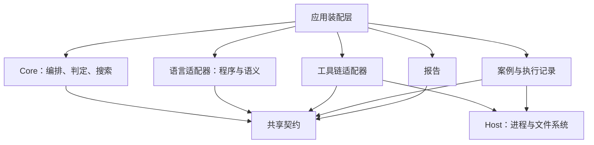
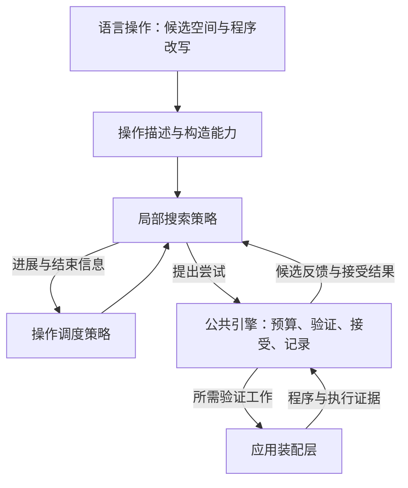

# MoonSmith Core 架构设计

设计日期：2026 年 10 月 10 日。本文细化[FP-0001](../fps/FP-0001-workspace-modules.md)中的 Core 协作模型，
与 [FP-0002](../fps/FP-0002-core-execution-contract.md)共同约束职责和正确性边界。
算法、默认参数与工程机制的比较保留在[调研记录](core-research.md)，不作为固定实现要求。
当前基础实现包含[独立判断契约](../modules/contracts/src/assessment.mbt)、
[判定器](../modules/core/src/oracle.mbt)和[归约会话](../modules/core/src/session.mbt)。
现有[枚举归约器](../modules/core/src/reducer.mbt)复用该会话；
执行与确认流程仍由[app](../modules/cli/src/app/campaign.mbt)推进。当前行为见
[原型执行契约](../CONTRIBUTING.md#原型执行契约)；下文是演进设计，不能据此宣称原型已满足全部保证。

## 1 目标与设计范围

Core 负责测试编排、证据判定与归约搜索。当前假设适配语言具有类似 MoonBit 的程序和工具链能力，
先服务已有测试闭环；真实的第二种语言需求出现后再调整扩展边界。

本设计要求具体搜索方法可以更换，同时保持语言合法性、失败判据、资源限制和证据含义一致。
不预建通用语言模型，也不为假想差异设计能力协商或动态插件体系。

## 2 责任与依赖

箭头表示代码依赖。Core 与具体适配器通过应用层协作，不产生对语言 AST 或宿主 I/O 的依赖。
保留既有四个 module；以下划分是职责单元，不要求增加 package。

| 单元 | 拥有的决定或状态 | 边界 |
| --- | --- | --- |
| campaign | 案例与配置的编排、进度、整体预算 | 不负责进程、路径或具体语言生成规则 |
| oracle | 证据适用性、异常判断与失败判据 | 不解析原始进程输出，不实现语言求值 |
| reduction | 搜索进度、候选评估、接受与停止 | 不修改 AST 内部结构，不覆盖原案例 |
| 语言适配器 | 程序表示、合法性、参考语义、观察协议与改写 | 不决定测试异常是否成立，不直接运行编译器 |
| 应用装配层 | 具体能力装配、执行与结果关联 | 不另行定义归约接受或异常判定逻辑 |
| Host、存储与报告 | 资源管理、证据保存、结果呈现 | 不补齐缺失证据或推断未执行的结果 |

Core 使用泛型程序值 `P`。语言适配器解释其内部结构，Core 仅保存、转交并消费相应元数据和证据。
原程序具有稳定身份，派生程序与原件分离；具体内存布局、复制方式和持久化编码由实现决定。

## 3 编排与证据流

Core 根据配置、预算和已有证据提出工作，应用层协调语言及工具链能力，将取得的结果关联到原工作
上下文后回传。Core 据此判定并决定后续工作，应用层保存案例、执行事实和派生判断之间的关系。
此协作不规定任务粒度、调用方式、并行度或事务顺序；保存失败和执行中断必须可见，不能产生完整成功的报告。

配置、随机输入、预算和工具链上下文显式提供；实现声明确定性的适用范围。
输入生成的可复现性、Core 决策的可复现性和编译器异常的稳定性分别验证。
同一 seed 不构成跨生成器版本或跨执行环境的兼容承诺。

## 4 判断、失败保持与确认

每项 Oracle 保留自己的结论、适用条件与证据。案例汇总表达所有相关异常及检查完整性，
不以单个主结论覆盖其他结果。缺失证据、超时、环境不可用与正常的语义差异分别表达。

FailurePredicate 描述归约需要保持的观察条件：相关配置、阶段、类别及输出或变形关系。
具体字段随 Oracle 的证据需求定义，不以错误文本或展示用指纹替代。判据持续成立不代表根因已确认。

候选必须取得自身的证据。参考判断使用候选的参考结果；关系判断检查候选及其关联程序的前提和结果。
候选改变以后，旧观察不能自动获得继续使用的资格。失败保持要求稳定，而具体输出值不必保持不变。

确认策略负责声明稳定性要求、需要的独立观察及冲突处理；Core 执行并记录实际完成情况。
策略需要的新执行不能用缓存代替，未完成确认和确认不稳定不能混淆。固定复跑次数或按失败类别
分配次数都属于实现选项，不写入架构保证。

## 5 可替换的归约策略

### 协作模型

| 边界 | 输入与产出关系 | 保留的实现自由 |
| --- | --- | --- |
| 语言操作 | 程序与约束 → 可操作对象、构造候选及合法性结果 | 树改写、组合删除或其他语言相关方法 |
| 操作调度 | 可用操作、预算与进展 → 下一搜索范围 | 固定、分层、反馈驱动或组合调度 |
| 局部搜索 | 搜索范围与历史反馈 → 下一尝试或局部结束 | 枚举、分组、自适应或其他算法 |
| 公共引擎 | 尝试与验证证据 → 反馈、接受记录和会话结果 | 验证工作组织与结果复用，不改变判据和整体约束 |

语言操作提供搜索所需的最小信息。例如，组合删除需要可选择的元素组，单次改写需要独立的候选。
这两者是说明边界的例子，不是封闭的操作枚举。不同策略所需的权重、结构或历史信息按真实需求增加，
不要求语言适配器暴露整棵 AST，也不强制全部策略使用同一候选容器。

操作描述应明确其适用的程序上下文，避免程序变化后继续应用失效操作。组合改写仍需合法性检查，
Core 不假定单个操作合法就意味着任意组合合法。

调度和局部搜索各自持有必要状态。策略只能提出尝试并利用反馈；接受决定由引擎按照明确规则执行。
实现可使用静态函数、泛型或其他适合 MoonBit 的组织方式，无需把这一分层变成插件框架。

### 策略自由与公共约束

搜索方法决定在哪里探索；规模度量定义怎样比较结果；接受规则定义哪些中间步骤可以进入搜索状态。
三者分别表达，具体算法不隐含成为其他实现必须遵守的流程。

所有实现共同遵守：

- 保持原失败判据，不以另一种异常冒充搜索成功。
- 候选的合法性及比较资格由语言适配器确认。
- 满足、不满足、非法与不可判定等反馈保持区别，证据不足不能被当作确定的否定。
- 遵守整体预算、取消和资源限制，策略切换与局部进展不能隐式重置限额。
- 保存原案例以及候选、验证和接受之间的关系，不用搜索状态覆盖历史证据。
- 返回实际结果、停止原因与可支持的保证，预算耗尽不等于策略已穷尽。

严格下降可作为接受规则的一种实现。探索等规模或较大中间程序需要明确增长、去重和停止约束，
并受整体预算限制。对外比较原始案例与最佳结果，不能仅凭策略名称宣称局部或全局最小性。

## 6 实现选择与演进

提案与架构保留责任和行为约束；实现记录说明所选策略、参数、适用范围和验证证据。
算法集合、pass 顺序、复跑次数、规模编码、随机流派生、缓存和保存机制都不由本文固定。
前期讨论过的实现候选见[调研中的候选记录](core-research.md#6-实现候选与评估方法)，不构成实现清单。

首个实现需要通过实际可替换的策略检验边界，不能只声明一个无人能替换的接口。
验证顺序以职责为依据：先用合成程序与证据检验判定和搜索，再接入语言操作，最后取得真实工具链证据。
不要求一次实现全部调研算法，也不把某个文件划分或阶段编号作为公共契约。

在相同案例、判据、操作空间和预算下比较策略，报告结果规模、有效候选、执行成本及停止原因。
搜索选择与公共约束不应混为一个实验变量。没有实测数据时，不按上游论文性能为本项目排默认优先级。

案例重放保留实际输入与执行上下文，搜索状态恢复单独设计；两者不相互隐含。
保持公开契约的算法替换按正常实现演进；改变语义或责任时遵守提案约定。

### 当前基础实现

`Assessment` 保存各 Oracle 的判断，`FailurePredicate` 和 `match_failure` 明确原型归约要保持的
Oracle、配置、阶段与异常类别。参考判断一次保留全部配置结果，原型报告的主结论仅是展示视图。
编译与执行分别保留稳定的检查身份；编译未成功时执行检查不适用，不能把阶段变化当作结果丢失。
复杂关系判据、确认策略与跨案例编排仍待实现。

`ReductionSession[P]` 接收外部选择的候选，将合法性、接受资格、失败保持、候选预算和记录集中管理。
接受规则与最佳结果排序分别传入，允许策略探索不同规模的中间程序而保留原程序和最佳已知结果。
当前会话一次等待一个候选，以会话标识和尝试序号关联响应；预算计数包括非法与不符合接受规则的候选。
这些是基础实现的具体选择，不约束未来的调度方式或并行度。

策略切换继续使用同一会话，不重置预算。现有 `Reducer[P]` 提供严格下降的枚举驱动；
行为测试另以线性与二分搜索驱动同一公共引擎，检验候选选择可独立替换。
会话不引入隐式随机性，确定性依赖固定输入、反馈顺序、不可变程序值与纯回调。

候选、决定、证据与停止原因保存在追加式内存记录中。取消阻止迟到响应推进会话，进程回收仍由 Host 负责。
新记录尚未接入案例持久化或搜索恢复，原型 `Case` / `Attempt` 格式不变；
CLI 仅适配新的归约接口。库接口约束见[Core README](../modules/core/README.md)。

## 7 验收边界

| 场景 | 可观察要求 |
| --- | --- |
| 更换调度或局部搜索 | 共用判定、预算和证据路径，语言语义不被复制到策略内 |
| 固定输入与反馈 | 在声明条件下产生可重现的决定，宿主噪声不隐式进入随机选择 |
| 一个案例出现多项异常及缺失结果 | 各项证据同时保留，案例完整性不会被单个结论覆盖 |
| 候选非法、关系失效或出现另一类异常 | 不接受为保持原判据的结果，拒绝或不可判定原因可追溯 |
| 程序变化或组合改写 | 不应用失效操作，不假定组合仍然合法 |
| 参考或变形判断 | 使用候选自己的有效证据，不复用失效前提或观察 |
| 确认结果冲突或证据不足 | 区分不稳定与未完成，不报告为稳定异常 |
| 策略无进展、反复提案或预算耗尽 | 有界停止并保存原案例与最佳已知结果，不夸大最小性 |
| 取消、保存失败或执行中断 | 保留已取得证据，报告实际完成范围 |
| 更换算法后进行比较 | 指标由实际记录推导，明确比较条件与保证范围 |

首个实现范围为 Core 库、共享契约和行为测试；新架构接入现有 MoonBit、Host 与 CLI 的集成另行验收。
文档门禁、合成测试、Host 实验与真实 MoonBit 案例分别提供不同证据，
不能相互替代；检查入口以[贡献指南](../CONTRIBUTING.md)为准。
