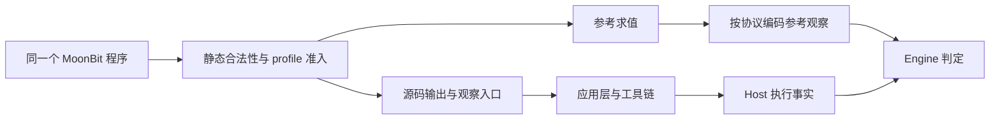

# FP-0002: MoonBit 程序模型与语义契约

## 摘要

MoonBit 模块为同一个程序提供合法性检查、子集准入判断、参考求值、源码输出、类型引导生成、
结构特征和归约候选。这些能力共同遵守明确的语义规则，使测试能够回答程序为什么可以比较、
预期观察是什么，以及候选改变后哪些证据必须重新取得。

本设计沿用 [FP-0001](FP-0001-workspace-modules.md#包的职责与依赖)的责任划分。
语言适配器拥有程序和语义；Engine 拥有异常判定与归约接受；应用层装配能力；Host 提供执行事实。
本提案约束输入、结果和不变量，不固定 AST 枚举、函数签名、文件划分或通用语言接口。
实现依赖和推进条件集中在[路线图](../ROADMAP.md#moonbit-语义模型的推进顺序)。

## 动机

### 当前实现与问题证据

以下观察基于主线 `3fa5b8d` 的源码和已有测试，尚未通过本设计的新验收场景：

| 依据 | 当前行为 | 需要明确的契约 |
| --- | --- | --- |
| [程序模型](../modules/moonbit/src/program.mbt) | 分开的 `IntExpr`、`BoolExpr`，整数绑定序列和整数结果 | 表示已排除部分类型错误，但引用、profile 和资源限制仍需检查 |
| [求值与合法性](../modules/moonbit/src/program.mbt) | `valid()` 以求值成功为依据；条件表达式同时检查两个分支的运算范围 | 全树准入要求与实际执行路径应分别表达 |
| [生成器](../modules/moonbit/src/generate.mbt) | ChaCha8、固定种子编码、三个绑定、限定深度和小整数常量 | 生成配置与语言模型的合法程序集合应分别定义 |
| [归约候选](../modules/moonbit/src/reduce.mbt) | 删除绑定、修正索引、以零或子表达式替换，再筛选合法且更小的程序 | 候选可以改变值；类型保持与语义保持具有不同要求 |
| [应用层](../modules/cli/src/app/campaign.mbt) | 为候选重新求值并生成参考文本；重放比对重新生成的源码 | 参考值、源码和观察必须属于同一程序；种子不足以承诺跨版本重现 |
| [行为测试](../modules/moonbit/src/program_wbtest.mbt) | 有手算值、非法引用、死分支溢出、固定种子及引用修复测试 | 这些是原型基线，不能证明扩展构造或全部后端已通过 |

继续把准入和求值合在一起，会在加入函数、模式匹配或资源预算时难以区分非法输入、
当前子集不支持、解释资源耗尽和正常结果。改变这种区分又会影响 Engine 可使用的证据、
生成有效性统计和历史案例解释，需要先说明保证和迁移边界。

### 方案取舍

| 方案 | 收益与代价 | 本提案处理 |
| --- | --- | --- |
| 保持现状，继续在每个能力中增加分支 | 改动较少，但新构造的语义和错误含义容易分散 | 保留为源码基线，不作为长期契约 |
| 先统一 MoonBit 的语义保证，再按真实调用调整实现 | 可以沿用已有效的类型化表示，并独立验证各项义务 | 采用此设计方向 |
| 先建立跨语言 AST、适配器 trait 和能力协商框架 | 需要在第二语言出现前承诺大量接口，缺少验证依据 | 留给真实跨语言需求，本提案不设计 |

设计边界以[项目申报书](../docs/project-proposal.md#核心功能范围)为依据。
类型引导生成与参考求值已有实现；函数、元组、枚举及其完整观察和归约能力仍是目标。

## 设计

### 1. 程序集合与 profile

<a id="term-semantic-profile"></a>

语义 profile 是一组可识别的语义子集约束，规定允许的类型和构造、运算定义域、
终止要求、参考求值适用范围及可比较的观察。它是语言层的规则，不承担工具链执行调度。

应区分以下信息，即使最初仍用简单数据结构传递：

| 信息 | 决定什么 |
| --- | --- |
| 语义子集及其版本 | 哪些程序被准入、运算含义和参考求值前提 |
| 生成器实现及配置 | 从种子和预算构造哪个程序，包括规则顺序与随机选择 |
| 观察协议及其版本 | 如何把值编码为输出、如何解释收到的输出 |
| 工具链配置 | 用哪个编译器、后端和优化配置取得执行事实 |

同一合法程序可以来自手工构造或归约，不要求符合某个生成器的采样分布。
生成器的默认绑定数、常量分布和深度也不自动成为语言模型的限制。
工具链是否支持某个 profile 需要验证，不能从后端名称推断。

`int-bool-v1` 是首个兼容基线：整数常量、整数引用、加减、比较、布尔否定、分支、顺序整数绑定，
最终输出一个整数。生成器的三个绑定和 `0..4` 深度范围按当前实现保留。
它拒绝被检查的越界运算，包括未选择分支中的运算；本提案不通过分离职责静默放宽这个范围。
它不包含循环、递归或程序自身的外部输入，输出由固定入口负责。

### 2. 程序表示的共同不变量

<a id="term-moonbit-program"></a>

MoonBit 程序是语言适配器解释的完整程序表示，保留类型、绑定和作用域关系，并具有可观察的入口结果。
它可以由生成、手工构造或归约产生，不等同于某个生成器的采样配置或输出源码文本。

程序表示由 [MoonBit 适配器](FP-0001-workspace-modules.md#term-language-adapter)拥有，
Engine 和 Contracts 不解释 AST。类型环境、绑定身份和运行时值属于语言内部概念，
不因为多个语言层函数使用它们就移入共享契约。

合法程序至少满足以下不变量：

- 每个表达式具有确定类型，运算实参和分支结果符合该构造的类型规则。
- 每个变量引用都指向当前词法作用域内可见的绑定；绑定身份与输出源码中的名字分别处理。
- 使用前定义、参数绑定和作用域退出遵守该 profile 的规则。未执行代码也必须通过静态检查。
- 完整程序没有未提供的自由变量，入口结果属于该 profile 可观察的类型。
- 改写绑定或结构后，引用仍指向预期绑定，不能因重排或命名碰撞而意外捕获变量。

当前分开的表达式树已经在构造层保证部分类型关系，可继续使用。
是否引入统一表达式类型、显式 `Ty`、稳定绑定 ID 或额外封装，由新构造的实际需求决定。
即使构造 API 保证类型正确，公共输入及改写结果仍需检查不能由表示保证的约束。

### 3. 合法性、准入与求值分别表达

<a id="term-program-well-formedness"></a>

静态合法性判断程序的类型、引用和结构是否自洽。它检查完整程序，不能只因执行未走到错误位置就认定合法。

<a id="term-profile-admission"></a>

profile 准入判断合法程序是否满足所选语义子集及参考语义的前提。
被排除不等于 MoonBit 语言非法，也不能据此判定编译器有错。

<a id="term-reference-evaluation"></a>

参考求值在明确的输入、语义和适用前提下计算程序的预期值。
资源耗尽或求值器内部错误表示未取得参考结果，不能编码成正常值或待测编译器的失败。

这是可区分的语义结果，不要求三次遍历或三个公共类型。实现可以共享访问与分析结果，
但调用方必须能辨别失败来自哪一层。检查所需资源不足时表达为未能完成检查，不能假装证明了非法。

例如，下列程序的条件确定为真：

```moonbit
if true { 0 } else { 2147483647 + 1 }
```

两个分支都要接受类型与作用域检查；实际执行只选择真分支。当前无溢出基线仍可以因为
另一分支的运算范围而拒绝它，但这个拒绝属于 profile 准入，不能被解释为两个分支都会执行。
参考求值器可以只接受已准入程序；此例用来区分规则，不要求执行产品已拒绝的输入。

MoonBit 官方文档将 `Int` 定义为 32 位有符号整数，标准库说明加减采用回绕运算。
无溢出范围是 MoonSmith 主动选择的较窄子集，不是 MoonBit 的语言规则。
未来若覆盖回绕运算，需明确新的准入范围和参考运算规则，再验证各目标配置；本提案不提前选定扩展方案。

有限 AST、无循环和无递归能够支持终止论证，但不意味着任意程序都能在固定资源内解释完毕。
若引入求值预算，预算耗尽属于未取得参考结果；尤其非递归函数的重复调用也可能产生很大计算量。
不得据此给待测编译器生成“结果错误”的证据。

### 4. 参考值、源码与观察一致

对准入程序，参考求值和源码输出必须解释同一份结构、绑定和运算规则。
分支选择、参数传递以及未来复合值的含义，需要由语言规则和手工案例验证，不能用渲染后的程序
反过来充当唯一参考解释器。

源码输出负责稳定命名、正确的字面量和括号、类型所需的源码结构，以及约定的结果输出入口。
它不改变 AST 来绕过编译失败；遇到不能表达的构造时显式失败。
源码渲染失败属于语言工具自身的问题，不是待测编译器的执行观察。

<a id="term-observation-protocol"></a>

观察协议规定语义值如何编码成可比较的输出，以及收到的输出如何被解释。它由语言层拥有，
不能通过忽略协议外的差异来改变比较结论。

应用层选择相关能力，Host 保留实际 stdout、stderr 和进程状态，
Engine 按约定判断证据。当前整数协议是十进制文本加换行，不能任意裁剪空白或丢弃额外输出后认定相等。
未来元组与枚举若成为入口结果，必须先确定保留类型、字段顺序与构造器差异的编码，不能直接依赖调试打印。



源码应被声明支持的基线工具链接受，这是渲染器的验证义务。
针对待测工具链的拒绝仍要保留原始材料，检查是生成器、渲染器、环境还是编译器的问题；
“内部合法”本身不能证明编译器缺陷，实际接受率也不能代替类型和语义依据。

### 5. 类型引导生成与结构特征

生成器根据 profile、期望类型、当前作用域、显式随机输入和预算选择构造规则，再递归生成子项。
类型、绑定可见性和终止条件在构造时满足；完成后的检查用于验证生成器保证，
不能把无界重试非法程序作为获得合法程序的唯一机制。

生成在声明预算内完成或明确报告无法构造。实现需要说明节点、深度、定义数量或尝试次数
中哪些受到限制，以及子生成任务如何共同消耗预算；具体默认值和规则权重属于生成策略。
预算不足不能被隐藏成一个未报告的默认程序，拒绝和失败尝试也应进入统计。

可复现范围包含 profile、生成器实现及随机算法版本、种子和配置。
这些输入相同时，结构和源码应稳定；只固定 seed 不构成跨生成器或标准库版本的承诺。
随机选择与外部执行是否稳定分别验证。

<a id="term-structural-feature"></a>

结构特征是从实际程序提取的构造、引用或明确的结构关系，具有可从 AST 检查的依据。
例如，包含加法、条件嵌套深度和
引用同一绑定的次数，都可以用 AST 给出可检查依据。
“同时包含函数调用和分支”与“分支条件包含函数调用”是不同性质，需要不同定义。
静态特征不宣称分支被执行，也不代表编译器内部路径覆盖。

特征提取应适用于手工、生成和归约后的程序。生成过程可顺便计算特征，但结果必须与独立的
结构提取一致；程序改变后重新计算或验证失效范围。首轮不设计反馈调度、覆盖驱动权重或通用特征注册框架。

### 6. 语义保持变换与失败用例归约

| 操作 | 语言层保证 | Engine 所需证据 |
| --- | --- | --- |
| 语义保持变换 | 在声明前提下，原程序与变体保持指定观察关系 | 原程序和变体各自的有效执行，以及关系适用性 |
| 归约候选 | 候选满足声明的类型、作用域和 profile 约束，提供规模信息 | 候选自己的参考结果与执行，证明原失败判据仍成立 |

<a id="term-semantics-preserving-transformation"></a>

语义保持变换是在声明前提下令原程序与变体保持指定观察关系的语言操作。
每项变换必须说明适用条件和保持的关系。例如，安全的局部重命名依赖绑定身份，
不能仅替换文本；一项代数重写也不能未经检查就用于所有运算定义域。
未来存在异常或副作用的构造时，需要重新审视既有变换的前提。

<a id="term-reduction-candidate"></a>

归约候选是语言层为缩减失败案例提出的派生程序，满足声明的类型、作用域和 profile 约束，
但尚不具有 Engine 的接受结论。候选必须使用自身的参考结果和执行证据验证原失败判据。

归约不要求 `Eval(candidate) = Eval(original)`。以零替换整数表达式可以改变结果，
只要候选仍具有比较资格，并且使用候选自己的参考值验证同一失败判据。
旧参考值、旧结构特征或另一类执行失败都不能冒充候选的新证据。

语言层负责构造与验证候选、修复引用并提供确定性的规模度量和候选顺序。
具体搜索、资源总限额、接受与停止属于 [Engine](FP-0001-workspace-modules.md#term-engine)。
首个基线继续使用已有的更小候选，但严格下降不是所有未来搜索策略必须采用的语言语义。
候选集合非空不意味着一定能接受缩减，搜索结束也不证明全局最小。

组合改写必须重新验证，不能从每个单步都合法推断组合必然合法。
所有派生程序都有自己的结构与证据，原案例和既有执行记录保持不变。

### 7. 用首版扩展目标检验模型

下面列出进入支持范围前必须补齐的义务，不代表这些构造已经实现，也不固定具体 AST：

| 构造 | 程序与准入 | 求值与输出 | 生成与归约 |
| --- | --- | --- | --- |
| 更丰富的局部绑定 | 类型、词法作用域、遮蔽和绑定身份 | 环境扩展与源码命名一致 | 在正确上下文生成；删除或移动绑定不产生捕获 |
| 一阶非递归函数 | 参数与返回类型、调用引用、无环调用图 | 参数传递、调用结果及解释资源边界 | 有界构造函数与调用；删除、替换或内联后重新检查依赖 |
| 元组 | 元素类型、数量及合法投影 | 构造、投影；进入观察时保留结构信息 | 子项类型正确；投影或结构改写不能破坏使用方类型 |
| 非递归枚举与匹配 | 构造器参数、有限类型依赖、匹配完备性及分支绑定 | 构造器选择和分支求值；观察区分构造器与载荷 | 生成可匹配值；简化构造器或分支后仍完备且引用合法 |

函数、元组和枚举沿用申报书的首版目标，具体子集和观察编码在进入实现前确定。
其中至少要明确函数参数允许的类型、枚举载荷范围，以及复合值是否直接成为入口结果。
这些选择不影响本提案先建立共同不变量，也不能从表格推断为已选定的语言能力。

每种构造只有在合法性、准入、参考求值、源码输出、生成和适用的归约规则一同验证后，
才进入完整语义测试 profile。只完成渲染或生成时，应报告实际完成范围。
差分专用 profile、浮点、递归、可变状态、异常、FFI 和并发不由本设计顺带引入。

## 兼容性

四模块及依赖方向保持不变。已有 `IntExpr`、`BoolExpr` 和 `Program` 可作为实现起点，
不要求为本设计提前创建新 package、通用接口或 SemaForge 模块。

首个实现应在分开判断含义的同时保持 `int-bool-v1` 的已声明输入范围、生成结果和观察协议，
包括死分支越界的准入限制。不要把职责分离变成静默放宽输入或改变历史参考值的理由。
公开 API 若需要从 `Bool` 或可选值演进为可区分结果，应同步修改实际调用方和相应行为测试。

当前案例记录中的 `generator`、seed 和深度不足以单独标识所有未来语义与生成变化。
新实现若改变准入规则、生成结果或观察含义，需要声明版本与兼容边界；记录格式增加字段时
由语言层、Contracts、应用层和存储共同验证，但不把具体 AST 放进通用契约。

历史源码、参考结果和原执行记录保留。重生成不一致时明确报告兼容性问题，不能覆盖旧源码或
用新参考值静默解释旧结论；重放执行与从种子重生成分别描述。
是否提供旧版本重生成或显式迁移路径，随实际格式变更决定，本提案不预建兼容层。

## 验证

### 可观察验收

| 场景 | 应观察到的行为 |
| --- | --- |
| 悬空、前向引用、错误参数类型或分支类型 | 静态检查拒绝；未执行位置不能豁免 |
| 类型正确但不满足 profile 的程序 | 给出准入拒绝，不能称为 MoonBit 编译器异常 |
| 真分支返回零，另一分支包含越界运算 | 分别检验静态合法性、当前 profile 拒绝与条件求值规则，避免混为一个原因 |
| 手工算例、整数边界和小规模穷举 | 参考值符合独立预期；不只用生成器输出或自我比较作依据 |
| 已准入程序遇到解释预算耗尽或内部错误 | 不产生正常参考值，不据此报告编译器语义差异 |
| 相同生成版本、profile、种子和配置 | 结构、源码和特征一致；声明预算内完成或明确结束 |
| 手工及归约程序的特征提取 | 与实际结构一致，不沿用旧特征，也不夸大动态覆盖 |
| 渲染到声明支持的真实工具链配置 | 保存源码、工具链版本、检查及执行结果，比较约定观察 |
| 删除绑定、重命名或组合改写 | 类型与引用含义正确；语义保持操作验证关系，归约重新计算候选参考值 |
| 归约产生另一类失败或缺失候选参考结果 | 不接受为保持原失败的结果，保留原案例及已有证据 |
| profile、生成器或观察协议变化后重放 | 不静默替换原源码和参考结果；兼容范围与不支持原因可识别 |
| 加入函数、元组或枚举 | 同一构造贯穿语言层能力与真实执行，不能以存在 AST 节点作为验收 |

统计分别记录生成尝试、内部合法性、profile 准入、参考求值和各工具链的接受与执行情况。
构造正确性以不产生非法输出为目标，失败样本不能从分母中删除。
编译器接受率是独立实验指标；具体样本数量和比赛验收阈值沿用
[项目验收计划](../docs/project-proposal.md#预期验收产物)，本提案不另设一套阈值。

参考求值器也可能出错，且当前工具本身使用 MoonBit 实现。手工预期、小规模独立检查和
不同编译配置提供互补证据；参考结果与待测结果一致不构成形式化正确性证明。
故障注入、历史案例复现和新异常候选分别报告。

### 检查入口与证据范围

提案元数据、术语归属与索引由现有 ZenDev 检查验证，链接和锚点由 lychee 检查。
执行入口按[贡献指南](../CONTRIBUTING.md#常用命令)，文档检查不能替代上述行为验收。
实现时补齐相关行为测试，并取得所声明工具链配置的真实执行证据；接口存在或编译通过不表示语义保证已成立。

### 外部依据

调研日期为 2026 年 10 月 10 日；仓库基线要求 MoonBit `0.10.14+7d59c7ec9`。
官方在线文档会更新，具体扩展需在所声明工具链版本上重新验证：

- [MoonBit 语言基础](https://docs.moonbitlang.com/en/stable/language/fundamentals.html)：基本类型和语言构造的语义来源。
- [MoonBit 标准库整数运算](https://github.com/moonbitlang/core/blob/main/builtin/intrinsics.mbt)：`Int` 加减回绕的实现与说明；本机随当前工具链安装的源码也具有相同说明。

上述来源支持语言事实，不证明 MoonSmith 的生成器、参考求值器或多后端实验已经通过本设计验收。

AI 辅助范围为源码对照与设计起草；语义与实验结论需人工核验。
